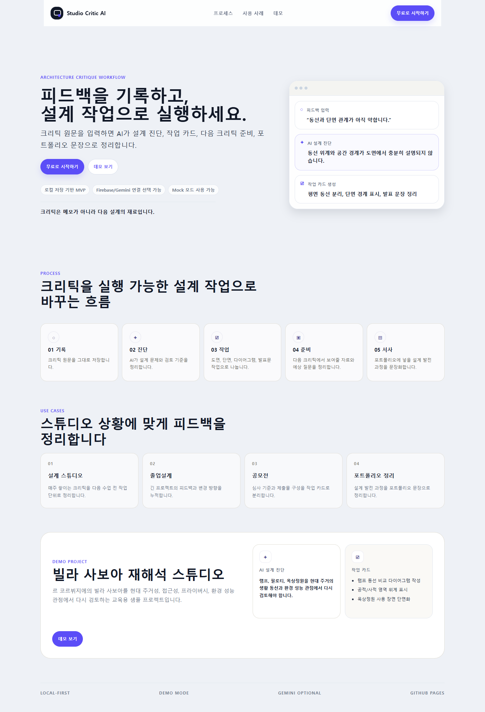
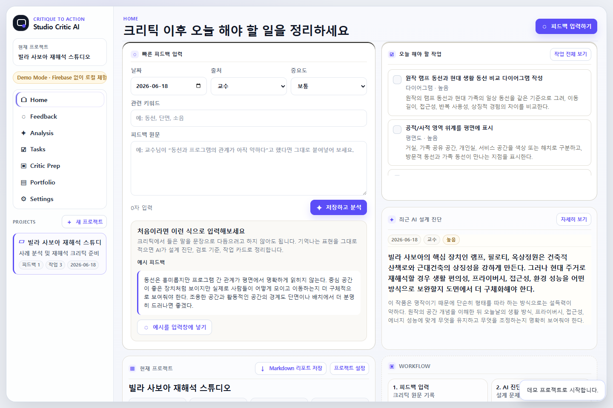
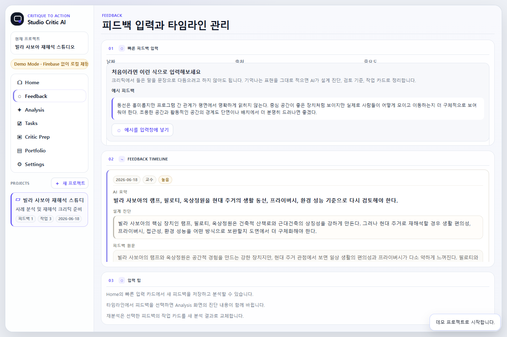
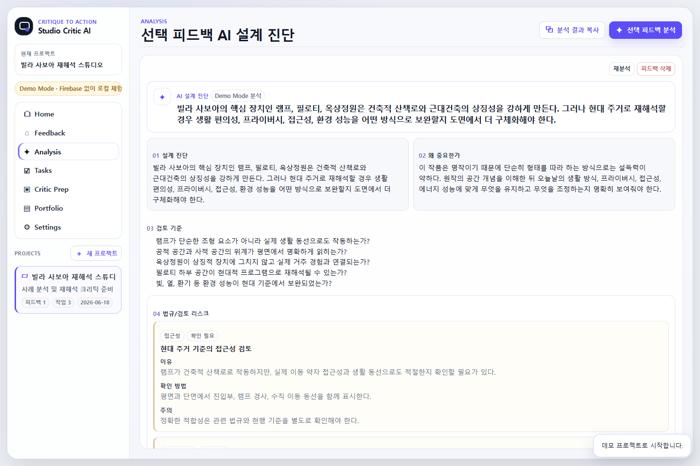

# Studio Critic AI

건축 설계 크리틱 피드백을 설계 진단, 작업 카드, 다음 크리틱 준비, 발표 문장, 포트폴리오 서사로 변환하는 AI 스튜디오 매니저형 웹앱

## 프로젝트 소개

Studio Critic AI는 건축학과 학생이 크리틱 이후 흩어진 피드백을 실행 가능한 설계 작업으로 전환할 수 있도록 만든 로컬 기반 AI 웹앱입니다.

교수, 팀원, 클라이언트, 본인 메모 등에서 나온 피드백을 입력하면 AI가 설계상 문제를 진단하고, 다음에 해야 할 작업, 도면/다이어그램 산출물, 다음 크리틱 준비 항목, 발표 문장, 포트폴리오 서사로 정리합니다.

이 프로젝트의 목표는 ChatGPT보다 더 똑똑한 AI를 만드는 것이 아니라, 매번 긴 프로젝트 맥락을 설명하고 결과를 따로 정리해야 하는 과정을 줄이는 것입니다.

## 미리보기









## 해결하려는 문제

건축 설계 크리틱 이후에는 다음과 같은 문제가 자주 발생합니다.

- 교수 피드백은 들었지만 무엇부터 수정해야 할지 정리되지 않음
- 피드백이 도면 작업, 다이어그램 작업, 발표 문장으로 바로 연결되지 않음
- 다음 크리틱 전까지 보여줘야 할 자료가 명확하지 않음
- 포트폴리오를 만들 때 설계가 어떻게 발전했는지 서사화하기 어려움
- 매번 AI에게 프로젝트 맥락과 출력 형식을 다시 설명해야 함

Studio Critic AI는 이 과정을 하나의 고정된 건축 설계 워크플로우로 정리합니다.

## 주요 기능

### 프로젝트 관리

- 프로젝트 생성 / 선택 / 삭제
- 졸업설계, 공모전, 스튜디오 크리틱, 포트폴리오 정리, 리노베이션, 도시/인프라 프로젝트 템플릿
- localStorage 기반 저장
- JSON 백업 / 불러오기
- 샘플 프로젝트 복원
- 전체 초기화

### 피드백 관리

- 날짜, 출처, 중요도, 키워드, 원문 입력
- 피드백 타임라인
- 피드백 재분석 / 삭제
- 긴 피드백과 AI 진단 결과 내부 스크롤 처리

### AI 분석

- Firebase AI Logic + Gemini 기반 텍스트 분석
- Firebase config가 없는 환경에서는 Demo/Mock Mode 작동
- 분석 중 오버레이
- 무관 입력 가드
- 프롬프트 조작성 입력 방어
- 법규/검토 리스크 힌트

### 작업 카드

- AI 분석 결과 기반 작업 카드 자동 생성
- 해야 함 / 진행 중 / 완료 / 보류 상태 관리
- 작업 삭제
- Tasks View 칸반형 표시

### 결과 활용

- 분석 결과 복사
- 작업 리스트 복사
- 다음 크리틱 준비 내용 복사
- 포트폴리오 문장 복사
- Markdown 리포트 저장

## 화면 구성

- Landing: 앱 소개 및 시작
- Start: 데모, 새 프로젝트, 백업 불러오기 선택
- Home: 빠른 피드백 입력, 현재 프로젝트 요약, 최근 AI 진단, 오늘 할 작업
- Feedback: 피드백 입력과 타임라인 관리
- Analysis: 선택 피드백의 상세 AI 분석
- Tasks: 작업 카드 칸반 보드
- Critic Prep: 다음 크리틱 준비 항목 생성
- Portfolio: 포트폴리오 서사 생성
- Settings: 프로젝트 설정, 백업, 초기화, Firebase 상태 확인

## 기술 구조

- HTML
- CSS
- JavaScript
- localStorage
- Firebase AI Logic
- Gemini Developer API
- GitHub Pages

별도의 백엔드 서버, Firestore, Firebase Auth, Firebase Storage 없이 정적 웹앱 구조로 작동합니다.

## 무료 운영 구조

이 MVP는 추가 서버 비용 없이 작동하는 구조를 목표로 합니다.

- 기본 데이터 저장: 브라우저 localStorage
- 공개 배포: GitHub Pages
- AI 분석: Firebase AI Logic + Gemini Developer API
- Firebase 설정이 없는 공개 배포 환경: Demo/Mock Mode

주의: localStorage 기반이므로 브라우저를 바꾸거나 저장소를 초기화하면 데이터가 사라질 수 있습니다. 중요한 데이터는 JSON 백업 기능으로 저장해야 합니다.

## Demo Mode

GitHub Pages 공개 배포본에는 실제 `src/firebaseConfig.js`가 포함되지 않습니다.

따라서 공개 데모에서는 Firebase/Gemini 실제 호출 대신 Demo/Mock Mode로 작동합니다.

Demo Mode에서도 다음 흐름은 체험할 수 있습니다.

- 샘플 프로젝트 보기
- 피드백 입력
- Mock 분석 결과 확인
- 작업 카드 생성
- 복사 기능
- Markdown 리포트 저장
- JSON 백업 / 불러오기

실제 Gemini 분석은 로컬 환경에서 `src/firebaseConfig.js`를 설정한 뒤 테스트할 수 있습니다.

## 로컬 실행 방법

Windows 기준으로 프로젝트 폴더에서 정적 파일 서버를 실행합니다.

```bash
cd "C:\Users\j01\Documents\studio-critic-ai"
npx serve . -l 4173
```

터미널에 표시되는 Local 주소로 접속합니다.

```txt
http://localhost:4173
```

Python이 설치되어 있다면 아래 방식도 사용할 수 있습니다.

```bash
python -m http.server 4173
```

Python 실행 파일명이 `python3`인 환경에서는 다음 명령을 사용할 수 있습니다.

```bash
python3 -m http.server 4173
```

## Firebase / Gemini 설정 방법

1. Firebase Console에서 프로젝트를 생성합니다.
2. Web App을 등록합니다.
3. Firebase AI Logic에서 Gemini Developer API provider를 설정합니다.
4. `src/firebaseConfig.example.js`를 복사해 `src/firebaseConfig.js`를 만듭니다.
5. Firebase Console의 Web App config 값을 붙여넣습니다.

`src/firebaseConfig.js` 예시:

```js
export const firebaseConfig = {
  apiKey: "YOUR_FIREBASE_WEB_API_KEY",
  authDomain: "YOUR_PROJECT_ID.firebaseapp.com",
  projectId: "YOUR_PROJECT_ID",
  storageBucket: "YOUR_PROJECT_ID.firebasestorage.app",
  messagingSenderId: "YOUR_SENDER_ID",
  appId: "YOUR_FIREBASE_APP_ID"
};
```

주의:

- `<script>` 태그를 넣지 마세요.
- `initializeApp()` 코드를 넣지 마세요.
- Gemini API key를 직접 넣지 마세요.
- 이 파일은 Git에 커밋하면 안 됩니다.

## Gemini 분석 실패: Firebase API 키가 유효하지 않습니다

이 오류는 `src/firebaseConfig.js` 파일이 없다는 뜻은 아닐 수 있습니다. 파일이 정상 로드되어도 Firebase 웹앱 config와 AI Logic / Gemini provider 설정이 맞지 않으면 실제 Gemini 호출이 실패하고 앱은 Mock 분석으로 대체됩니다.

가능한 원인:

1. `src/firebaseConfig.js`에 Firebase Console의 web config가 정확히 들어가지 않음
2. 다른 Firebase 프로젝트의 config를 붙여넣음
3. Firebase Console에서 등록한 웹앱의 config가 아니라 다른 키를 사용함
4. Firebase AI Logic에서 Gemini Developer API provider 설정을 완료하지 않음
5. 설정 직후 백엔드 반영이 아직 안 됨
6. Google Cloud Console에서 해당 API key가 삭제되었거나 제한 설정이 맞지 않음

해결 순서:

1. Firebase Console > Project settings > General > Your apps로 이동
2. 현재 웹앱의 SDK setup config를 다시 복사
3. `src/firebaseConfig.js`의 `firebaseConfig` 객체를 교체
4. Firebase Console > AI Logic에서 Gemini Developer API provider 설정 완료 여부 확인
5. 몇 분 기다린 뒤 로컬 서버 새로고침
6. 다시 피드백 분석 실행

중요:

- Gemini API key를 직접 `src/firebaseConfig.js`에 넣지 마세요.
- `src/firebaseConfig.js`는 GitHub에 커밋하지 마세요.
- 공개 배포에서 실제 AI 연결을 켤 경우 App Check 등 보호 설정을 검토하세요.

## 보안 주의사항

다음 파일은 절대 공개 저장소에 커밋하지 마세요.

- `src/firebaseConfig.js`
- `.env`
- `.env.local`
- `.env.production`

현재 `.gitignore`는 위 파일들이 커밋되지 않도록 설정되어 있습니다.

GitHub Desktop에서 커밋하기 전 Changes 목록에 `src/firebaseConfig.js`가 없는지 반드시 확인하세요.

## localStorage 주의사항

현재 데이터는 서버 DB가 아니라 브라우저 `localStorage`에 저장됩니다.

- 같은 컴퓨터라도 브라우저를 바꾸면 데이터가 보이지 않을 수 있습니다.
- 다른 기기와 자동 동기화되지 않습니다.
- 브라우저 캐시나 사이트 데이터를 삭제하면 기록이 사라질 수 있습니다.
- 중요한 작업 기록은 Settings의 `JSON 백업`으로 저장하세요.
- 백업 파일은 Settings의 `백업 불러오기`로 다시 복원할 수 있습니다.

## JSON 백업 / 불러오기

Settings View의 `JSON 백업` 버튼을 누르면 현재 프로젝트, 피드백, 분석 결과, 작업 카드가 하나의 JSON 파일로 저장됩니다.

복원할 때는 `백업 불러오기`를 누르고 이전에 내보낸 백업 파일을 선택합니다. 다른 앱에서 만든 JSON이나 구조가 깨진 파일은 불러올 수 없습니다.

Landing Page의 시작 방식 선택에서 `백업 불러오기`를 고르면 앱이 Settings View로 이동하고 백업 영역을 확인할 수 있습니다.

## Markdown 리포트 저장

Settings View 또는 Portfolio View에서 `Markdown 리포트 저장`을 누르면 현재 프로젝트의 핵심 정보가 `.md` 파일로 저장됩니다.

내보내는 내용:

- 프로젝트 정보
- 피드백 요약
- AI 설계 진단
- 작업 리스트
- 다음 크리틱 준비
- 포트폴리오 서사

## 샘플 프로젝트

공개 데모에는 사용자의 실제 작업과 무관한 교육용 샘플 프로젝트가 포함되어 있습니다.

샘플 프로젝트:

**빌라 사보아 재해석 스튜디오**

르 코르뷔지에의 빌라 사보아를 현대 주거성, 접근성, 프라이버시, 환경 성능 관점에서 다시 해석하는 사례 분석 프로젝트입니다.

실제 사진, 도면, 평면도 이미지는 포함하지 않고 텍스트 기반 교육용 예시만 사용합니다.

## 법규/검토 리스크 안내

Studio Critic AI는 법규 자동 판정기가 아닙니다.

AI 분석 결과의 법규/검토 리스크는 설계자가 다음 크리틱이나 검토 전에 확인하면 좋을 항목을 제안하는 체크리스트입니다.

예:

- 피난 동선 확인
- 접근성 검토
- 주차 기준 확인
- 방화구획 검토
- 용도지역 / 지구단위계획 확인

실제 인허가 및 적합성 판단은 최신 법령, 지자체 조례, 토지이음, 세움터, 전문가 검토를 통해 확인해야 합니다.

## GitHub에 올릴 핵심 파일

이 프로젝트는 HTML/CSS/JavaScript 기반 정적 웹앱입니다. 최소 업로드 파일은 다음과 같습니다.

- `index.html`
- `src/app.js`
- `src/styles.css`
- `src/firebaseConfig.example.js`
- `README.md`
- `.gitignore`

GitHub Pages 배포 전에는 실제 API 키가 포함된 `src/firebaseConfig.js`가 커밋되지 않았는지 반드시 확인하세요.

## 배포 방법

### GitHub Pages

1. GitHub 저장소의 Settings > Pages로 이동합니다.
2. Source를 현재 브랜치의 루트 폴더로 설정합니다.
3. 배포 후 `index.html`이 진입점으로 사용됩니다.

이 프로젝트는 GitHub Pages에서 새로고침 404를 피하기 위해 hash routing을 사용합니다.

```txt
#/landing
#/start
#/app/home
#/app/feedback
#/app/analysis
#/app/tasks
#/app/critic-prep
#/app/portfolio
#/app/settings
```

공개 데모 배포에서는 `src/firebaseConfig.js`를 올리지 않아도 됩니다. 이 경우 앱은 Demo/Mock Mode로 작동합니다.

### Firebase Hosting

Firebase Hosting을 쓰는 경우에도 정적 파일만 배포합니다.

```bash
firebase init hosting
firebase deploy --only hosting
```

루트 배포를 선택하거나, 필요하면 `index.html`과 `src/`를 hosting public 폴더로 복사하세요.

## 테스트

```bash
node --check src/app.js
git diff --check
git check-ignore -v src/firebaseConfig.js firebaseConfig.js .env .env.local
```

브라우저 확인 주소:

```txt
http://localhost:4173
```

라우팅 확인 예:

```txt
http://localhost:4173/#/landing
http://localhost:4173/#/start
http://localhost:4173/#/app/tasks
```

## 향후 확장 계획

- Firebase Auth 기반 로그인
- Firestore 기반 클라우드 저장
- 사용자별 프로젝트 동기화
- 팀 협업 기능
- PDF / 이미지 기반 패널 피드백 분석
- 음성 크리틱 입력
- 선택한 피드백만 Markdown 저장
- 발표문 전용 생성 기능
- 작업 검색 / 필터
